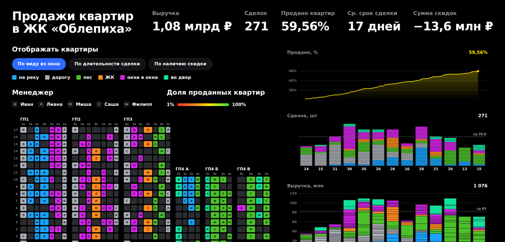

# Дашборд продаж — ЖК «Облепиха»

**Открыть дашборд → https://ЛОГИН.github.io/oblepikha/**
<!-- после публикации замените ЛОГИН на свой ник на гитхабе -->

Интерактивная визуализация продаж квартир: 455 квартир, 271 сделка,
2 июня — 25 августа 2022 года, выручка 1,08 млрд ₽.



## Что он отвечает

**Что происходит с продажами.** Они не заканчиваются, а замедляются: 20,5 сделки
в неделю против 23,5 месяцем раньше (−13%). Выручку держит подорожавший чек —
с 3,1 млн в июне до 5,0 млн в августе. В экспозиции 184 квартиры на 591 млн, при
нынешнем темпе это девять недель — но остаток структурно хуже проданного: средний
прайс 3,2 млн против 4,0 млн, доля «окна в окна» выросла с 30% до 37%.

**Кому премия.** Ивану — 67 сделок при скидке 0,94% и медиане срока 12 дней;
Саше — 221 млн почти без торга (0,32%). Разговор с Филиппом: он первый по выручке,
но 58% сделок со скидкой и 7,2 млн дисконта — больше половины всех скидок
комплекса; торгуйся он как команда, застройщик получил бы на 4,9 млн больше.
Разговор с Мишей — про ассортимент, а не про объём: он вышел на три недели позже
и по темпу идёт вровень с Сашей, но продаёт по 59 тыс за м² против 69 тыс.

**Какие квартиры стоят.** Продаются вид на дорогу (68%) и на лес (67%),
трёшки от 90 м² (66%), ГП-1 (72%). Стоят «окна в окна» (50% — треть всей
экспозиции), этажи 2–4 (49%), ГП-3 (50%). Цена продажи не тормозит: дорогой
сегмент реализован на 71%, дешёвый — на 52%. Стоят не дорогие квартиры,
а неудачные.

## Как устроено

**Частица данных — квартира.** Одна строка выгрузки = один квадратик. Проданная
и непроданная квартира — одна частица в разных состояниях, поэтому стоят рядом
на одном графике. Цвет кодирует состояние: синий — продана по прайсу, оранжевый —
со скидкой, серый — в экспозиции. Бирюзовый отдан менеджерам, жёлтый — интерфейсу.
Больше цветов на дашборде нет. Палитра прогнана через проверку на контраст и
различимость при протанопии, дейтеранопии и тританопии — по всем парам.

Из этих же квадратиков собраны каркасы: разрез дома (строка — этаж, шкала этажей
общая для всех корпусов), недельные столбцы (шириной ровно в один атом, снизу
сделки по прайсу, сверху со скидкой), однострочные ряды по признакам. Где атомов
слишком много, чтобы их различать, возвращаются полосы и шкалы.

План комплекса снят со схемы застройщика в масштабе 1:2. Заливка по выбранной
метрике, клик по корпусу или секции фильтрует весь дашборд. Секция берётся из кода
квартиры: `М-ГП4-В-116` → `ГП4-В`.

## Данные

`js/data.js` — обычный JS-файл с массивом `window.SALES_DATA`, поэтому страница
открывается и с диска, без сервера и CORS. Поля: код квартиры, корпус, этаж,
комнатность, планировка, площадь, прайс за м², прайсовая и продажная цена, скидка,
менеджер, даты обращения и сделки, дни в работе, вид из окон. У непроданных
квартир цена продажи, скидка, менеджер и даты пусты — таких 184.

Неделя считается с понедельника по воскресенье; последняя неделя выгрузки неполная,
она выделена подложкой и в расчёт темпа не входит. Цена за м² — взвешенная
(выручка ÷ проданная площадь). По сроку сделки выводится медиана: распределение
скошено вправо.

## Запуск

Дашборд открывается двойным кликом по `index.html` — сборка не нужна.
Vue 3 подгружается с CDN, D3 лежит локально в `vendor/`.

```
index.html          разметка и шаблон Vue
css/styles.css      оформление, обе темы через CSS-переменные
js/data.js          данные
js/stats.js         фильтры, агрегаты, форматирование — чистые функции
js/charts.js        отрисовка на D3
js/app.js           Vue: состояние и фильтры
```

`stats.js` и `charts.js` ничего не знают про Vue — это тонкий слой поверх чистых
функций.
